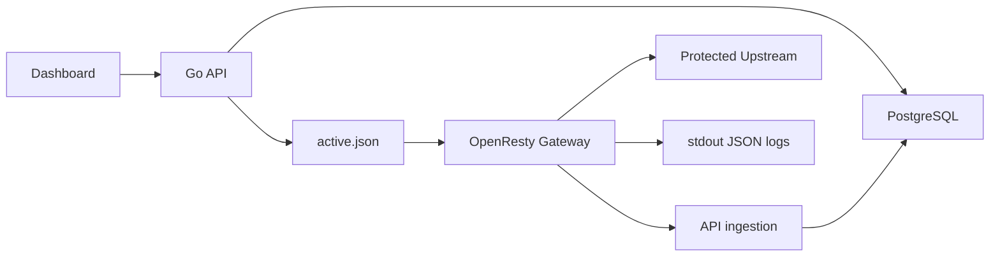

# LiteWaf 架构说明

LiteWaf 由控制面、管理后台、数据面网关和存储组件组成。核心原则是：配置在控制面维护，发布后生成网关可消费的 JSON 配置；网关热路径只读取本地配置和共享字典，不访问远程数据库。

## 组件边界

| 组件 | 目录 | 职责 |
| --- | --- | --- |
| Dashboard | 配套前端仓库 / 镜像 | 站点、规则、策略、日志、发布和系统页面 |
| API | 当前仓库 | 管理 API、鉴权、审计、发布、日志接收、观测汇总 |
| Gateway | 配套网关仓库 / 镜像 | OpenResty 反向代理、WAF 检测、限流、日志和指标 |
| PostgreSQL | Compose 服务 | 用户、站点、规则、策略、发布、审计和日志存储 |
| Redis | Compose 服务 | 预留轻量状态和后续同步能力 |
| upstream | `deploy/upstream` | 本地验证服务，不属于生产默认拓扑 |

## 配置发布流

1. 管理员在 Dashboard 或 API 中维护站点、规则、策略、名单和限流。
2. API 校验配置并创建发布版本。
3. API 写出 `active.json` 到共享网关配置目录。
4. Gateway 周期性加载配置并在请求链路中执行。
5. Gateway 输出 JSON 访问日志和 WAF 事件，并可 best-effort 上报 API。

## 请求处理顺序

网关按以下顺序处理请求：

1. 生成或透传 request ID。
2. 匹配 Host 对应站点。
3. 白名单短路放行。
4. 黑名单阻断。
5. 限流和重复违规封禁。
6. WAF 规则、归一化目标、评分阈值、Body 和上传元数据检测。
7. 代理到上游或返回阻断响应。
8. 输出访问日志和 WAF 事件。

## 部署边界

- `deploy/docker-compose.yml` 用于本地开发和 MVP 验证，可包含验证 upstream。
- `deploy/docker-compose.prod.yml` 用于生产部署，不启动验证 upstream。
- `deploy/docker-compose.validation.yml` 是生产 Compose 的可选验证 override，仅在用户明确启用时启动 upstream。
- 生产环境建议使用预构建镜像，不在宿主机现场构建 Go、Node 或 OpenResty。

## 可观测

API 提供访问日志、攻击日志、观测汇总和基础指标端点。Gateway 提供结构化日志和可选 Prometheus 文本指标。生产环境默认关闭公开指标暴露，建议仅在内网或受保护反向代理后开启。
